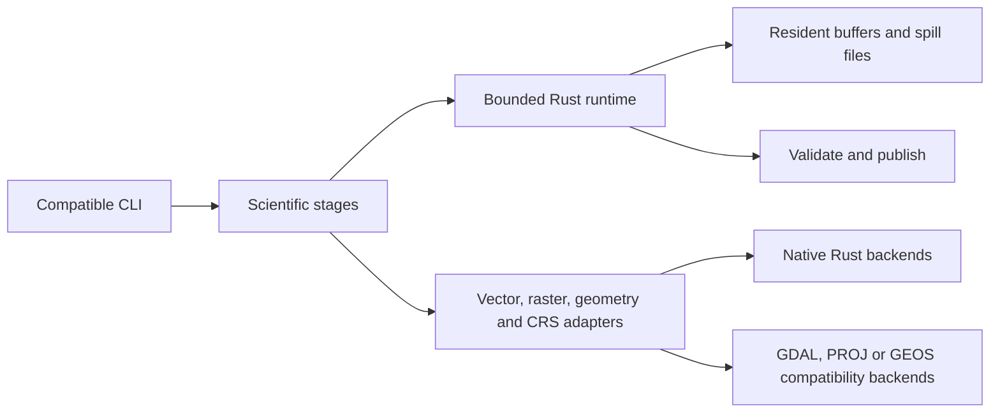

**Rust-native redesign — proposed architecture, 9 October 2026**

The selected direction is a standalone Rust library and CLI, with scientific
behavior preserved and the current command names, options, published filenames,
and file schemas kept compatible. The Python API and execution internals are
replaceable. The objective is simpler execution and predictable resource use,
as well as performance. This changes the recommendation from the initial
[Python performance assessment](rust-assessment.md): further Python performance
engineering is not a prerequisite for the redesign.

This document is a design, not an implemented Rust migration. Crate
capabilities were checked against current primary documentation and selected
source; no Rust backend has yet passed this project's interoperability tests.

**Keep the scientific contracts; replace their machinery.**

| Preserve | Replace |
| --- | --- |
| Explicit generic segment/downstream IDs, sink handling, filtering, cycle rejection, upstream metrics, and outlet precedence | Python dictionaries/Pandas access and provider-specific request batching |
| Aggregation eligibility, chain/confluence rules, evolving short-group merges, representative IDs, dense remapping, and stable processing order | Pandas group reductions and temporary GeoPackage/SQL dissolution orchestration |
| Canonical grid, cell ownership, catchment overlap handling, downstream-priority segment collisions, masks, and units | Python raster orchestration and working-raster heuristics |
| Catchment-confined AGREE, natural D8, deterministic flats, lexicographic shallow breaching, raw-DEM HAND, and geodesic LTND | Numba dispatch, compilation caches, and process-local warmup |
| Exact reach percentiles, HRU denominators, flooded areas at stages 1–100, partial-nodata rules, and tributary tie semantics | NumPy/Pandas accumulation and CSV assembly machinery |
| CLI commands/options, output schemas, CRS validation, domain failures, and staged publication with rollback | Click, spawned worker pools, IPC, serialization, and runtime-specific exceptions |

Scientific behavior includes numeric and geometric conventions. For example,
the default NumPy linear percentiles and `isclose` tolerance used for maximum
LTND ties must be carried into Rust. Replacing geodesic areas with projected
pixel area, treating a line union as concatenation, or changing raster boundary
coverage would change results. Existing tests and current source are the
reference; the copied QGIS-era implementation is not the oracle.

Container byte identity is not required for a different writer. Compare
schemas, feature ordering where specified, geometry meaning, masks, grid/CRS,
and scientific values. Require identical discrete ownership/direction/ID
decisions and repeatable outputs for a fixed Rust backend. Compare continuous
values against explicit, fixture-backed tolerances that cannot conceal changed
branch decisions. Exact current CSV formatting/order should be the initial
target. Changing a numerical acceptance criterion must be an explicit decision.

**Start with one package, a library, and a thin CLI.**

```text
cli          existing five commands, options, progress, overwrite checks
model        typed IDs, topology, grid, masks, scientific parameters
science      ROI, aggregation, preparation rules, terrain, sampling
execution    one bounded runtime, memory accounting, spill files, publication
io           vector records, raster windows/tiles, CRS and geometry adapters
```

Modules are sufficient initially; this does not require separate crates for
every stage or a general workflow framework. Scientific functions accept
typed records, grids, and bounded storage access. They do not know about
GDAL handles, file formats, threads, or CLI parsing. Geometry and coordinate
operations are explicit services where a mature foreign library remains useful.
Arrow can be an I/O or spill format if needed; an Arrow → Pandas → NumPy chain
is not part of the new internal model. Avoid adding a dataframe/query engine
unless it removes a demonstrated requirement that typed iteration cannot cover.



**Use a small bounded runtime rather than recreating the Python executor.**

One explicitly sized CPU pool serves a stage/library invocation. Rayon is a
candidate for CPU scheduling and Crossbeam for bounded channels; ordinary
scoped worker threads are also reasonable if they make the admission path
clearer. Local files do not require an async runtime. Rayon exposes thread-pool
configuration; Crossbeam exposes bounded channels. Neither establishes a byte
limit for application data by itself.
[Rayon documentation](https://docs.rs/rayon/latest/rayon/struct.ThreadPoolBuilder.html),
[Crossbeam channel documentation](https://docs.rs/crossbeam-channel/latest/crossbeam_channel/)

The runtime needs three mechanisms: a byte budget, bounded work/results, and
temporary storage. Admit a task only after reserving its input, scratch, and
output allowance; workers must not wait for extra budget halfway through a
task while retaining other permits. Move buffer ownership between threads
instead of serializing arrays. A reservation stays with live data until it is
consumed or spilled. Account for buffer capacity, retained backing storage,
caches, writer/compression buffers, and global graph/index state.

Results carry stable ordinals. A coordinator reduces them in scientific order;
large or delayed results spill and yield small descriptors, so an early slow
task cannot cause an unbounded reorder buffer. Keep dispatch bounded too:
submitting every item to a thread pool is not a bounded plan. The I/O concurrency
limit remains separate from CPU worker count. Cancellation stops admission,
joins active workers, and cleans staging. Use the same machinery across stages.

`--memory-limit-mb` remains the user-facing sizing control. The redesign should
give it coherent application-memory accounting, instead of independent task
and scratch hints that can coexist above the nominal amount. It is not a
portable hard RSS ceiling: allocator overhead, foreign-library allocations,
mapped resident pages, and OS caches are separate concerns. Report accounted
peaks and observed process memory separately. A blocked task must not trigger
a quiet fallback to an unbounded allocation.

**Larger-than-memory support must cover every growing structure.**

| Structure | Proposed storage rule |
| --- | --- |
| Raster pixels and decoded masks | Window/tile access with a byte-limited cache; disk-backed working products |
| External IDs and topology | Dense internal indices with original IDs preserved; compact resident arrays when admitted, externally sorted tables and paged arrays when not |
| Adjacency, traversal queues and terrain basin graph | Include in the budget; spill queues/indexed adjacency when required |
| Geometry grouped by mini | External grouping by final mini ID; admit only bounded geometry work and bounded intermediates |
| Exact percentile samples | Spill samples and use exact external ordering/selection; do not substitute approximate quantiles |
| Completed tasks and final tables | Bounded reduction/spill; stream CSV rows after final column discovery |
| Vector/raster file indexes | Audit and budget metadata too; spill index construction when its resident form does not fit |

Whole-dataset support and support for a single oversized unit are distinct.
A dataset can exceed RAM while each mini/group fits the working budget. That
is a useful first milestone, matching the current complete-mini contract.
One mini whose routing scratch exceeds RAM requires paged arrays and external
graph/queue algorithms; merely dividing it into independent tiles changes flat
handling, basin connectivity, and drainage. A polygon union can likewise need
substantial intermediate storage. Until the corresponding external algorithm
exists, reject an oversized unit with a clear resource error and document that
limit. Do not claim universal larger-than-memory support from tiling alone.
Memory mapping a whole file also does not establish bounded resident memory.

**Replace GDAL by capability, with small verified adapters.**

| Capability | Native Rust path | Initial decision |
| --- | --- | --- |
| Hydrology and network algorithms | Typed Rust loops and graph algorithms | Implement natively |
| FlatGeobuf reading | `flatgeobuf`, optionally Geozero for geometry decoding | Strong early candidate |
| FlatGeobuf writing | `flatgeobuf` serialization plus bounded index/output construction | Audit growth; avoid assuming its writer is fully bounded |
| Ellipsoidal distances and areas | `geographiclib-rs`, configured with the source ellipsoid | Strong early candidate, subject to numerical parity |
| GeoTIFF/COG windows and tiles | `geotiff-reader` and `geotiff-writer` candidates | Interoperability trial before production selection |
| Polygon union and predicates | `geo`/its overlay algorithms | Trial against real geometries; keep GEOS where equivalence is unresolved |
| Line dissolution and representative points | Explicit native operations with parity fixtures | Separate from polygon union; retain a geometry adapter initially |
| Broad EPSG/ESRI/WKT CRS handling and transformation | Rust `proj` bindings | Retain PROJ initially; GDAL is not required merely to use PROJ |
| GeoPackage input | SQLite plus geometry/metadata decoding | Feasible narrower adapter; validate supported types/layers/CRS |
| Existing FileGDB input | GDAL compatibility adapter | Preserve support until a verified replacement exists |
| Current rasterization conventions | Native scan conversion eventually | Keep a narrow GDAL-backed operation until cell-exact parity is demonstrated |

FlatGeobuf provides sequential and spatially selected reads. Its inspected
writer spills feature bytes to a temporary file but retains feature offsets
and bounding-box nodes in `Vec`s. Those grow with feature count, including the
unindexed writer path. This makes it a useful building block, not proof of
bounded writing. Indexed ROI outputs need externally sorted spatial-index
metadata when that metadata exceeds budget; mini outputs must retain their
intentional unindexed physical order.
[FlatGeobuf reader](https://docs.rs/flatgeobuf/latest/flatgeobuf/struct.FgbReader.html),
[writer source](https://docs.rs/flatgeobuf/latest/src/flatgeobuf/file_writer.rs.html)

`geographiclib-rs` supports geodesic polygon accumulation and a `Geodesic::new(a,
f)` constructor. Supply the source CRS ellipsoid; do not assume WGS84. The
inspected `geo::GeodesicArea` implementation constructs WGS84 internally,
which is insufficient for this tool's arbitrary-ellipsoid contract.
[GeographicLib Rust API](https://docs.rs/geographiclib-rs/latest/geographiclib_rs/struct.Geodesic.html),
[polygon-area API](https://docs.rs/geographiclib-rs/latest/geographiclib_rs/),
[Geo area source](https://docs.rs/geo/latest/src/geo/algorithm/geodesic_area.rs.html)

Native GeoTIFF readers provide window access. The inspected native COG
tile writer stages base tiles in a temporary file on filesystem targets and
emits the layout when finalized. These are promising building blocks. The
high-level reader/writer APIs inspected do not establish the required internal
mask and custom-metadata behavior. Before selecting a backend, verify BigTIFF,
float/integer types, compression, internal masks and mask overviews, affine
pixel conventions, custom/non-EPSG CRS metadata, band units, `mini_index`,
`distance_method`, and validity-aware overview behavior. Nodata sentinels or
alpha bands must not silently replace the current internal-mask contract.
Low-level TIFF access may provide what high-level APIs omit, but that remains
implementation work. Keep GDAL I/O behind the same narrow interface until the
native backend passes.
[GeoTIFF reader](https://docs.rs/geotiff-reader/latest/geotiff_reader/),
[reader API](https://docs.rs/geotiff-reader/latest/geotiff_reader/struct.GeoTiffFile.html),
[COG tile writer](https://docs.rs/geotiff-writer/latest/geotiff_writer/cog/struct.CogTileWriter.html)

`geo` provides polygon union and other boolean operations, with validity and
fill-rule conventions. That does not establish equivalence to GEOS polygon
or line union, nor bounded intermediates. Test holes, touching rings,
overlaps, slivers, multipart geometries, and line crossings. Geometry
representation differences can change preparation ownership at boundaries.
[Geo boolean operations](https://docs.rs/geo/latest/geo/algorithm/bool_ops/trait.BooleanOps.html)

For CRS transformation, `proj4rs` is an interesting constrained alternative,
but its documentation states that it is not a PROJ replacement, lacks default
WKT support, and has experimental grid-shift support. Keep full PROJ behind a
Rust service for the present generic CRS contract. This preserves native Rust
execution while avoiding a broad CRS reimplementation.
[Proj4rs documentation](https://docs.rs/proj4rs/latest/proj4rs/),
[Rust PROJ bindings](https://github.com/georust/proj)

**Migration order and evidence.**

1. Extract portable scientific fixtures and expected products from the current
   tests: topology, aggregation assignments, preparation ownership, terrain
   routes/masks, and sampling statistics. Capture degenerate/tie cases before
   implementing replacement geometry/rasterization. Python remains a test
   oracle during migration, with no role in the Rust production runtime.
2. Establish the Rust library/compatible CLI, one runtime, spill cleanup,
   publication behavior, and narrow I/O adapters. Test cancellation,
   out-of-order completion, saturation, and rollback using meaningful failures.
3. Implement `sample-minis` as the first complete Rust command. It exercises
   bounded raster reading and exact statistics without requiring a new raster
   writer or vector dissolution. Spill exact reach samples and paired HAND/LTND
   values when needed; final maximum-LTND tie statistics may need a second pass.
4. Port the terrain kernels and graph search, then `terrain-products`, using
   complete-mini scheduling initially. Add an explicit oversized-mini limit
   until paged routing is implemented. Verify geodesic distances and scientific
   directions before comparing runtime.
5. Port `define-roi` and `aggregate` with compact/paged topology and external
   geometry grouping. Preserve the existing ID string tie-breaks after internal
   remapping. Avoid a new temporary spatial-SQL execution system solely to
   reproduce the current Python implementation.
6. Port `prepare`, using verified rasterization initially. Replace it with native
   scan conversion only after boundary, overlap, segment collision, buffer,
   nodata, and block-seam fixtures produce the same ownership.
7. Promote each native GIS backend independently after it passes the same
   interoperability/scientific fixtures and dataset/unit scaling checks. Remove
   the Python production implementation once the five commands have parity;
   an optional future Python wrapper can call the Rust library.

Success is a native CLI with one resource model, fewer runtime dependencies
and execution representations, deterministic scientific results, and measured
memory that plateaus as dataset size grows at fixed concurrency. Also vary
the largest mini, largest geometry group, topology size, number of features,
and number of queued results; fixed-size tile tests alone miss those limits.
Use disk-spill versus resident paths and one versus multiple workers as parity
checks. Independent GIS software should validate published files.

This redesign has an architectural benefit even if a particular Numba kernel
is already fast. The biggest simplifications come from eliminating interpreter
and JIT startup, process serialization, duplicated worker state, and conversion
chains. External algorithms and geospatial interoperability remain real work.
Keeping PROJ or a narrow GDAL/GEOS adapter where it saves that work is compatible
with a Rust-native architecture and can make the overall tool simpler.
